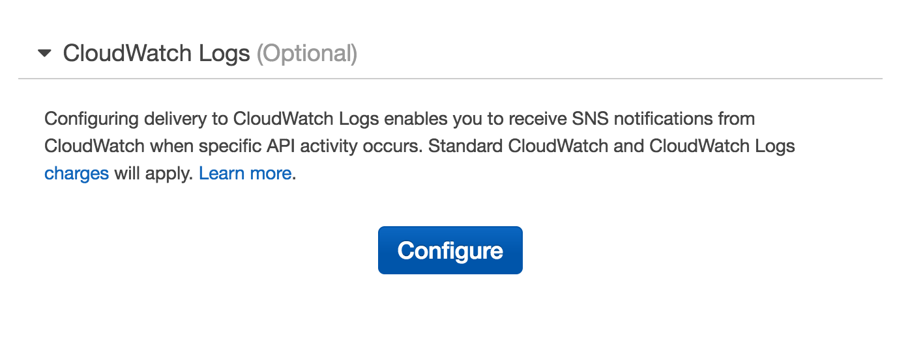
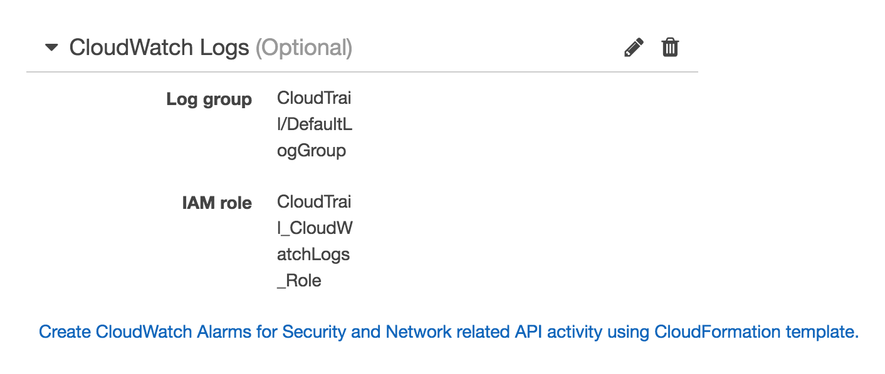
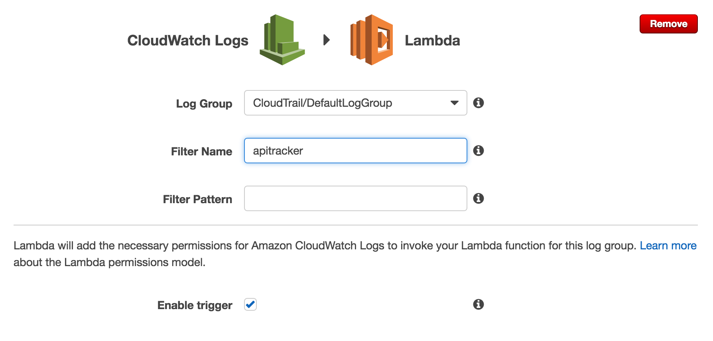

# AWS API Usage Tracker

This application was designed to give customers greater insight into their AWS API usage by generating custom CloudWatch Metrics based on CloudTrail logs.

**VERSION:** 0.1.1
**AUTHORS:** Joe Hsieh, Ho Ming Li, Jeremy Wallace

## Design

Here is the data flow:
- Amazon CloudTrail is configured to send API logs to Amazon CloudWatch Logs.
- AWS Lambda is triggered by new records that are written to the CloudWatch Log Stream.
- AWS Lambda aggregates the number of API requests and publishes custom Amazon CloudWatch Metrics.

# Installation

Below are two different ways of configuring your AWS environment to collect metrics on API usage using this lambda function. You could configure the AWS environment with the command line, or through the web console.

## Command Line Installation

1. [Follow the guide here](http://docs.aws.amazon.com/awscloudtrail/latest/userguide/send-cloudtrail-events-to-cloudwatch-logs.html) to send CloudTrail logs to CloudWatch Logs.
2. Create a role for the Lambda function:

  ```
  aws iam create-role --role-name apitrackerrole
  nano lambdapolicy.json

  {
    "Version": "2012-10-17",
    "Statement": [
    {
      "Effect": "Allow",
      "Action": [
      "logs:CreateLogGroup",
      "logs:CreateLogStream",
      "logs:PutLogEvents"
      ],
      "Resource": "arn:aws:logs:*:*:*"
      },
      {
        "Effect": "Allow",
        "Action": [
        "cloudwatch:PutMetricData"
        ],
        "Resource": [
        "*"
        ]
      }
      ]
    }

  aws iam create-policy --policy-name putMetricsPolicy --policy-document file://lambdapolicy.json
  aws iam attach-role-policy --role-name apitrackerrole --policy-arn <POLICY_ARN>
  ```
3. Clone this repository and zip up the content in the nodejs directory.

  ```
  cd nodejs
  zip -r apitracker.zip *
  ```
4. At a command prompt, run the following command, where role-arn is the Lambda execution role set up in the first step, substitute account 123456789123 with your own:

  ```
  aws lambda create-function \
      --function-name apitracker \
      --zip-file fileb://apitracker.zip \
      --role arn:aws:iam::123456789123:role/apitrackerrole \
      --handler app.handler \
      --runtime nodejs4.3
  ```
5. Grant CloudWatch Logs the permission to execute your function. At a command prompt, run the following command and substitute account 123456789123 with your own and change the log-group to be the log group you want to process:

  ```
  aws lambda add-permission \
      --function-name "apitracker" \
      --statement-id "apitracker" \
      --principal "logs.us-east-1.amazonaws.com" \
      --action "lambda:InvokeFunction" \
      --source-arn "arn:aws:logs:us-east-1:123456789123:log-group:CloudTrail/logs:*" \
      --source-account "123456789123"
  ```
6. Create a subscription filter. At a command prompt, run the following command and substitute account 123456789123 with your own and change the log-group-name to be the log group you want to process:

  ```
  aws logs put-subscription-filter \
      --log-group-name CloudTrail/logs \
      --filter-name apitracker \
      --filter-pattern "" \
      --destination-arn arn:aws:lambda:us-east-1:123456789123:function:apitracker
  ```

## Console Installation

Please follow the instructions below to configure API tracker.

### Part One: Enable CloudTrail and CloudWatch Logs

1. Create an AWS account and sign in to the *AWS Management Console*.
2. Under Management Tools, click on **CloudTrail**.

3. Click **Trails** on the left menu bar.
4. Click the blue **Add New Trail** button.

5. Name the trail and pick an *S3* bucket location to store the logs. Press create.
6. Once created, click on your newly created *CloudTrail*.
7. In the section *CloudWatch Logs*, click **configure**.

8. If you do not have a *CloudWatch Log Stream* created, name one here and press continue.
9. Review the *IAM* policy and press Allow.

10. Click back to the CloudTrail page and ensure that CloudWatch Logs has been configured.


### Part Two: Configure and Upload the Lambda function

1. Locally on your machine, run **npm install** in the **nodejs** directory (cloudwatch-api-tracker).
2. Create a new zip file based on the contents of this directory (cloudwatch-api-tracker).
3. Open the *Lambda* Console page.

4. Create a new lambda function.

5. Select the **Blank Function** blueprint.
6. Add a CloudWatch Logs Trigger.  

7. Name the filter and use the CloudTrail Log Group that you created above.

8. Press Next. Name the Lambda function.

9. Upload the ZIP file that you created above.

10. Set the handler to app.handler.

11. Create a new IAM role for the Lambda function with the following IAM policy.
```
{
  "Version": "2012-10-17",
  "Statement": [
  {
    "Effect": "Allow",
    "Action": [
    "logs:CreateLogGroup",
    "logs:CreateLogStream",
    "logs:PutLogEvents"
    ],
    "Resource": "arn:aws:logs:*:*:*"
    },
    {
      "Effect": "Allow",
      "Action": [
      "cloudwatch:PutMetricData"
      ],
      "Resource": [
      "*"
      ]
    }
    ]
  }
```

Congratulations! You have set up API tracker. You will now start to see metrics in CloudWatch.

## Things you can do with the metrics

- Create a CloudWatch Alarm on a particular API.
- Create a CloudWatch Dashboard with the most commonly used APIs.
